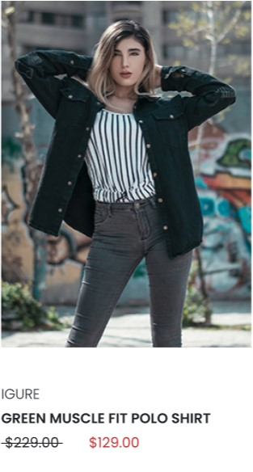
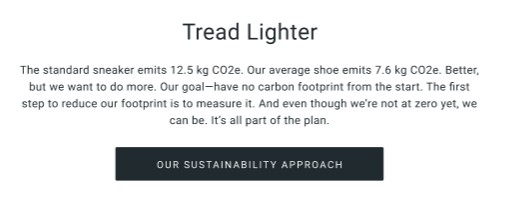

# BEM

```
    header.header>((a.header__logo>img.header__logo-img)+(nav.header__nav>ul.header__list>li.header__list-item*6)+(ul.header__user>li.header__user-item*3))
```

```
    card.card>(img.card__image+p.card__title+p.card__link+div.card__cost>(p.card__cost-old+p.card__cost-new))
```

```
    form.form>(label.form__label+input.form__input+button.form__submit)
```

```
    div.random>h3.random__header+p.random__text+button.random__button
```

```
    div.faq>a.faq__header+ul.faq__list>((li.faq__list-item>a.faq__link)*4)
```